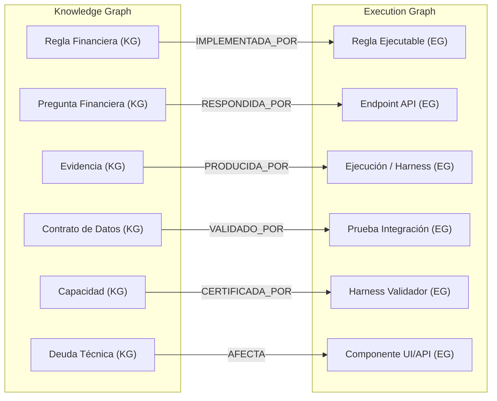

# MODELO DE ARQUITECTURA DE GRAFOS DUALES V1

## Propósito y Separación Conceptual
Establecer la especificación formal del **Modelo de Grafos Duales** para el **Marketplace Financial AI Engine**. Define la estructura, nodos, relaciones, cardinalidades y reglas de cruce entre dos grafos conceptualmente separados pero interconectados:
1. **Knowledge Graph**: Representa el conocimiento normativo, reglas contables, decisiones de arquitectura (ADRs), registros canónicos, evidencias documentales y deudas técnicas.
2. **Execution Graph**: Representa el comportamiento ejecutable, pipelines ETL, endpoints API, tablas/vistas DuckDB, jobs de conciliación, harness de pruebas y ejecuciones registradas.

---

## 1. Nodos Obligatorios del Knowledge Graph (24 Tipos de Nodo)

### 1.1 `Node:Documento`
- **Atributos Obligatorios**: `doc_id`, `titulo`, `ruta_relativa`, `hash_sha256`, `estado_documental` (`INBOX`..`ARCHIVADO`), `owner`.
- **Atributos Opcionales**: `tags`, `autor_original`, `fecha_creacion`.
- **Fuente**: `KnowledgeOS/` y `governance/`.
- **Owner**: Knowledge Steward.
- **Madurez**: Nivel 1 (Especificado).
- **Regla de Reemplazo**: Desplazado a `90_Archive` al crearse versión sucesora.

### 1.2 `Node:Registro_Canónico`
- **Atributos Obligatorios**: `canonical_id`, `nombre_concepto`, `definicion_unificada`, `version`, `estado` (`CANÓNICO`), `fuente_oficial`.
- **Atributos Opcionales**: `equivalentes_legacy`, `notas_auditoria`.
- **Fuente**: `KnowledgeOS/01_Canonical/`.
- **Owner**: Single Financial Truth Guardian.
- **Madurez**: Nivel 4 (Certificado).

### 1.3 `Node:Regla_Financiera`
- **Atributos Obligatorios**: `rule_id`, `nombre_regla`, `clasificacion_pnl`, `formula_conceptual`, `fuente_normativa`.
- **Atributos Opcionales**: `tolerancia_delta`, `aplica_marketplace`.
- **Fuente**: Economic Dictionary & Financial Engine Specs.
- **Owner**: Controller Financiero.
- **Madurez**: Nivel 4 (Certificado).

### 1.4 `Node:Concepto_Financiero`
- **Atributos Obligatorios**: `concept_id`, `nombre_canonico`, `grupo_financiero` (ingresos, devoluciones, cobros, disponible), `moneda`.
- **Atributos Opcionales**: `subgrupo`, `codigo_erp`.
- **Fuente**: `marketplace_ledger_v1` Concept Map.
- **Owner**: Financial Data Engineer.
- **Madurez**: Nivel 5 (Productivo - 96 conceptos).

### 1.5 `Node:Decisión_ADR`
- **Atributos Obligatorios**: `adr_id`, `titulo_decision`, `problema`, `decision_tomada`, `justificacion`, `estado`.
- **Atributos Opcionales**: `alternativas_descartadas`, `impacto`.
- **Fuente**: `governance/DECISION_REGISTRY_V1.md`.
- **Owner**: Chief Architect.
- **Madurez**: Nivel 4 (Certificado).

### 1.6 `Node:Referencia_Externa`
- **Atributos Obligatorios**: `ref_id`, `emisor` (SII, SAP, MP API), `norma_o_version`, `estado_adopcion`.
- **Fuente**: `governance/EXTERNAL_REFERENCE_ADOPTION_MATRIX_V1.md`.
- **Owner**: Domain Specialist.

### 1.7 `Node:Evidencia`
- **Atributos Obligatorios**: `evidence_id`, `tipo_evidencia`, `hash_sha256`, `ruta_archivo`, `execution_id`, `estado`.
- **Fuente**: `governance/EVIDENCE_REGISTRY_V1.md`.
- **Owner**: Evidence Guardian.

### 1.8 `Node:Certificación`
- **Atributos Obligatorios**: `cert_id`, `objeto_certificado`, `criterio_evaluado`, `resultado` (`PASS`), `fecha_certificacion`.
- **Fuente**: Governance Certification Reports.
- **Owner**: QA Lead.

### 1.9 `Node:Capacidad`
- **Atributos Obligatorios**: `cap_id`, `nombre_capacidad`, `descripcion`, `estado_fase1b` (`IMPLEMENTADO` | `VALIDADO` | `CERTIFICADO`).
- **Fuente**: `governance/CAPABILITY_REGISTRY_V1.md`.
- **Owner**: Product Owner.

### 1.10 `Node:Contrato_Datos`
- **Atributos Obligatorios**: `contract_id`, `origen`, `destino`, `version`, `politica_cambios`, `estado_certificacion`.
- **Fuente**: `governance/DATA_CONTRACT_REGISTRY_V1.md`.
- **Owner**: Data Architect.

### 1.11 `Node:Deuda_Técnica`
- **Atributos Obligatorios**: `td_id`, `componente_afectado`, `prioridad` (`CRÍTICA`..`DIFERIDA`), `riesgo`, `criterio_cierre`, `estado`.
- **Fuente**: `governance/TECHNICAL_DEBT_REGISTRY_V1.md`.
- **Owner**: Technical Debt Reviewer.

### 1.12 `Node:Pregunta_Financiera`
- **Atributos Obligatorios**: `question_id`, `enunciado`, `pregunta_num` (1 a 10), `cadena_evidencia_requerida`.
- **Fuente**: `governance/FINANCIAL_COPILOT_QUESTION_REGISTRY_V1.md`.
- **Owner**: AI & Copilot Architect.

### 1.13–1.24 `Nodos Adicionales del Knowledge Graph`
- `Node:Marketplace` (MELI, Paris, Ripley, Falabella)
- `Node:Archivo_RAW_Spec` (Manifiesto e inmutabilidad de RAW)
- `Node:XML_DTE_Spec` (Normativa SII DTE 33/43/52/61)
- `Node:SAP_Spec` (Estructura BAPI/IDoc SAP ERP)
- `Node:Settlement_Spec` (Especificación de Liquidaciones)
- `Node:Pago_Spec` (Especificación de Transferencias / TEF)
- `Node:Banco_Spec` (Especificación de Cartola Bancaria)
- `Node:Ledger_Spec` (Especificación de Doble Entrada Financiera)
- `Node:Knowledge_Item` (Elemento atómico del índice de conocimiento)
- `Node:Owner` (Rol o persona responsable de auditoría)
- `Node:Periodo` (Período mensual YYYY-MM)
- `Node:Fuente_Oficial` (Declaración de Single Source of Truth)

---

## 2. Nodos Obligatorios del Execution Graph (26 Tipos de Nodo)

### 2.1 `ExecNode:Endpoint`
- **Atributos Obligatorios**: `endpoint_id`, `path_url` (e.g. `/api/v4/cierre/desglose`), `metodo_http`, `handler_function`, `estado_certificacion`.
- **Entradas**: Query params / Request body.
- **Salidas**: HTTP Response JSON payload.
- **Owner**: Backend Engineer.
- **Madurez**: Nivel 4 (Certificado).

### 2.2 `ExecNode:Handler`
- **Atributos Obligatorios**: `handler_id`, `nombre_funcion`, `archivo_python`, `modulo`, `firma_parametros`.
- **Fuente**: `api/api.py`.
- **Owner**: Backend Engineer.

### 2.3 `ExecNode:Servicio`
- **Atributos Obligatorios**: `service_id`, `nombre_servicio`, `clase_python`, `responsabilidad_unica`.
- **Fuente**: Services Module.

### 2.4 `ExecNode:Componente`
- **Atributos Obligatorios**: `comp_id`, `nombre_componente`, `capa_pertenencia`, `criticidad`.
- **Fuente**: `ARCHITECTURE_REGISTRY_V1.md`.

### 2.5 `ExecNode:Módulo`
- **Atributos Obligatorios**: `module_id`, `nombre_modulo`, `directorio_padre`.

### 2.6 `ExecNode:Tabla_DuckDB`
- **Atributos Obligatorios**: `table_id`, `nombre_tabla` (e.g. `marketplace_ledger_v1`), `esquema`, `db_path`, `sha256_db`.
- **Fuente**: `data/db/meli_financial_v4.db`.
- **Owner**: Database Architect.
- **Madurez**: Nivel 5 (Productivo).

### 2.7 `ExecNode:Vista_DuckDB`
- **Atributos Obligatorios**: `view_id`, `nombre_vista`, `consulta_sql_origen`.

### 2.8 `ExecNode:Pipeline`
- **Atributos Obligatorios**: `pipeline_id`, `nombre_pipeline`, `script_orquestador`, `etapas`.
- **Fuente**: Ingestion Orchestrators.

### 2.9 `ExecNode:Job`
- **Atributos Obligatorios**: `job_id`, `frecuencia`, `comando_ejecucion`.

### 2.10 `ExecNode:Script`
- **Atributos Obligatorios**: `script_id`, `ruta_script`, `hash_sha256_script`.

### 2.11 `ExecNode:Proceso`
- **Atributos Obligatorios**: `process_id`, `nombre_proceso`, `pid_runtime`.

### 2.12 `ExecNode:Transformación`
- **Atributos Obligatorios**: `transform_id`, `tabla_origen`, `tabla_destino`, `sql_logic`.

### 2.13 `ExecNode:Regla_Ejecutable`
- **Atributos Obligatorios**: `exec_rule_id`, `nombre_funcion_assert`, `resultado_esperado`.

### 2.14 `ExecNode:Prueba_Unitaria`
- **Atributos Obligatorios**: `test_unit_id`, `nombre_test`, `archivo_test`, `suite`.

### 2.15 `ExecNode:Prueba_Integración`
- **Atributos Obligatorios**: `test_int_id`, `nombre_test`, `endpoint_testeado`, `golden_json_ref`.

### 2.16 `ExecNode:Harness`
- **Atributos Obligatorios**: `harness_id`, `script_harness` (`validate_fase_1b.py`), `metricas_reportadas`.

### 2.17 `ExecNode:Ejecución`
- **Atributos Obligatorios**: `exec_id`, `execution_id_hash`, `timestamp_inicio`, `timestamp_fin`, `resultado_global`.

### 2.18–2.26 `Nodos Adicionales del Execution Graph`
- `ExecNode:execution_id` (Hash de corrida ejecutable)
- `ExecNode:Resultado` (`PASS` | `FAIL` | `ERROR`)
- `ExecNode:Error` (Traceback o código de excepción HTTP/SQL)
- `ExecNode:Bloqueador` (Condición que impide avance de pipeline)
- `ExecNode:Reconciliación` (Rutina ejecutable de cuadratura $0 delta)
- `ExecNode:Certificación_Técnica` (Resultado del harness oficial)
- `ExecNode:Dependencia` (Módulo o paquete Python requerido)
- `ExecNode:Entorno` (Python 3.11+, Windows Shell, DuckDB V1.5.1)
- `ExecNode:Artefacto_Generado` (Archivo reportado en `evidence/`)

---

## 3. Catálogo de Relaciones (29 Relaciones Obligatorias)

| Relación | Dominio Origen | Dominio Destino | Cardinalidad | Dirección | Semántica de Auditoría |
| :--- | :--- | :--- | :---: | :---: | :--- |
| **`IMPLEMENTA`** | Code / Execution | Knowledge / Governance | N:M | → | El código ejecuta la especificación declarada |
| **`DEPENDE_DE`** | Any | Any | N:M | → | Requiere la existencia previa del destino |
| **`RESPONDE`** | API / Copilot | Pregunta Financiera | N:1 | → | Satisface la consulta del usuario |
| **`USA`** | Component | Component / Table | N:M | → | Utiliza datos o servicios del destino |
| **`CERTIFICA`** | Harness / Evidence | Capacidad / DB | 1:N | → | Otorga estatus de validez formal |
| **`ORIGINA`** | RAW / Source | Staging / Ledger | 1:N | → | Constituye la fuente primaria de datos |
| **`DERIVA_DE`** | Derived Table | Source Table | N:M | → | Trazabilidad de transformación SQL |
| **`REEMPLAZA`** | Document / Artifact | Legacy Artifact | 1:1 | → | Invalida y sustituye al elemento previo |
| **`VALIDA`** | Test / Harness | Contract / Endpoint | N:M | → | Comprueba cumplimiento de especificación |
| **`RESUELVE`** | Fix / PR | Technical Debt / Bug | N:1 | → | Elimina la deficiencia o deuda registrada |
| **`BLOQUEA`** | Issue / Technical Debt | Feature / Question | N:M | → | Impide el avance hasta su resolución |
| **`CONTRADICE`** | Document / Record | Canonical Truth | 1:1 | → | Genera alerta de incoherencia (Cuarentena) |
| **`AFECTA`** | Technical Debt | Component / Layer | N:M | → | Propaga impacto negativo en el sistema |
| **`PRODUCE`** | Process / Engine | Evidence / Report | 1:N | → | Genera artefacto probatorio de salida |
| **`CONSUME`** | Process / Engine | Contract / Data | N:M | → | Lee información según el contrato definido |
| **`EJECUTA`** | Job / Harness | Script / Test | 1:N | → | Corre proceso informático en tiempo real |
| **`FALLA_EN`** | Execution | Test / Assert | N:M | → | Registra error puntual de verificación |
| **`EVIDENCIA`** | Record / Claim | Evidence Item | N:M | → | Vincula una afirmación con su prueba hash |
| **`PERTENECE_A`** | Component | Layer | N:1 | → | Adscripción a la arquitectura de 12 capas |
| **`TRANSFORMA`** | ETL Process | Staging Data | N:M | → | Modifica estructura preservando valor |
| **`RECONCILIA`** | Engine Routine | Marketplace / Bank | N:M | → | Comprueba paridad de saldos $0 delta |
| **`EXPONE`** | API Layer | Contract / Service | 1:N | → | Hace accesible el servicio al exterior |
| **`MIDE`** | Metric / Benchmark | Component Performance | N:M | → | Evalúa tiempo de respuesta o precisión |
| **`CUMPLE`** | Component | Rule / Contract | N:M | → | Satisface las restricciones impuestas |
| **`VIOLA`** | Bug / Incident | Rule / Contract | N:M | → | Quiebra el contrato o norma definida |
| **`TRAZA`** | Lineage Engine | RAW to Copilot | 1:1 | → | Garantiza cadena de custodia de 11 pasos |
| **`SOPORTA`** | Evidence Layer | Decision / Claim | N:M | → | Fundamenta decisiones de arquitectura |

---

## 4. Puentes Obligatorios entre Grafos (Cross-Graph Bridges)



---

## 5. Modelado Obligatorio de Deuda Técnica (TD-001 a TD-008)

Cada ítem de deuda técnica se representa como un nodo `Node:Deuda_Técnica` en el Knowledge Graph y proyecta su impacto en el Execution Graph mediante la relación `AFECTA`:

```text
[TD-001: Golden Benchmarks Failed] ──AFECTA──> [ExecNode:test_golden.py] ──BLOQUEA──> [ExecNode:CI_CD_Pipeline]
[TD-002: Contratos Públicos Pendientes] ──AFECTA──> [ExecNode:api.py] ──BLOQUEA──> [Node:CTR-002]
[TD-003: Duplicación Reglas UI] ──AFECTA──> [ExecNode:dashboard.html] ──BLOQUEA──> [Node:Pregunta_8]
[TD-004: KnowledgeOS Inexistente] ──AFECTA──> [Node:Knowledge_Layer] ──BLOQUEA──> [Node:Knowledge_Graph]
[TD-005: Lineage Incompleto] ──AFECTA──> [Node:DATA_LINEAGE_REGISTRY] ──BLOQUEA──> [Node:CTR-010]
[TD-006: Question Registry Pendiente] ──AFECTA──> [Node:Financial_Copilot] ──BLOQUEA──> [Node:Pregunta_1..10]
[TD-007: Knowledge Graph Inexistente] ──AFECTA──> [Node:System_Intelligence] ──BLOQUEA──> [Node:RAG_Engine]
[TD-008: RAW Registry Pendiente] ──AFECTA──> [Node:CTR-001] ──BLOQUEA──> [Node:EVID-RAW-001]
```

---

## 6. Casos de Análisis de Auditoría por Grafos (16 Casos)

El Dual Graph permite ejecutar consultas automatizadas para detectar:
1. **Documentos Huérfanos**: Nodos `Documento` sin aristas `PERTENECE_A` ni `REFERENCIA`.
2. **Endpoints sin Contrato**: `ExecNode:Endpoint` sin relación `CUMPLE -> Node:Contrato_Datos`.
3. **Contratos sin Prueba**: `Node:Contrato_Datos` sin arista `VALIDADO_POR -> ExecNode:Prueba`.
4. **Pruebas sin Capacidad**: `ExecNode:Prueba` sin relación con `Node:Capacidad`.
5. **Capacidades sin Evidencia**: `Node:Capacidad` etiquetada `CERTIFICADO` sin `Node:Evidencia` hash SHA-256.
6. **Evidencias sin Hash**: `Node:Evidencia` con atributo `hash_sha256` nulo.
7. **Preguntas sin Cadena**: `Node:Pregunta_Financiera` sin trazabilidad completa de 11 pasos.
8. **Tablas sin Owner**: `ExecNode:Tabla_DuckDB` sin atributo `owner` asignado.
9. **Procesos sin Certificación**: `ExecNode:Pipeline` en producción sin `Node:Certificación`.
10. **Deuda Técnica de Alta Centralidad**: Nodos `TD` con >3 aristas `AFECTA` entrantes/salientes.
11. **Puntos Únicos de Fallo (SPOF)**: Nodos cuya remoción desconecta subgrafos completos.
12. **Contradicciones Documentales**: Nodos vinculados por la relación `CONTRADICE`.
13. **Trazabilidad Incompleta**: Cadenas de lineage donde falta al menos 1 de los 11 contratos.
14. **Dependencias Circulares**: Ciclos detectados en las aristas `DEPENDE_DE`.
15. **Referencias Externas No Adoptadas**: Nodos `Referencia_Externa` sin `ESTADO_ADOPCION == ADOPTADO`.
16. **Artefactos Reemplazados Activos**: Nodos con estado `REEMPLAZADO` que aún reciben aristas `USA`.

---

## 7. Compatibilidad con Obsidian y Reservas Tecnológicas Futuras

- **Sintaxis Obsidian**: Enlaces relacionales en Markdown mediante wikilinks `[[DUAL_GRAPH_ARCHITECTURE_MODEL_V1]]` y metadatos estructurados YAML frontmatter.
- **Reservas Tecnológicas de Grafos**:
  - Motores de Grafo Property Graph: **Neo4j** (Cypher) / **PostgreSQL + Apache AGE**.
  - Motores RDF / Semánticos: **SPARQL** / **RDFLib Python**.
  - Analítica de Grafos en Memoria: **NetworkX** / **DuckDB Graph Extensions**.
  - APIs de Consulta: **GraphQL** Graph Schemas.

---

## Nodos en Grafos de Gobierno

### Knowledge Graph Nodes
- `Node:DUAL_GRAPH_ARCHITECTURE_MODEL_V1` (Tipo: `Modelo_Grafo_Dual`)
- `Node:KNOWLEDGE_GRAPH_SPEC` (Tipo: `Especificacion_Grafo`)
- `Node:EXECUTION_GRAPH_SPEC` (Tipo: `Especificacion_Grafo`)

### Execution Graph Nodes
- `ExecNode:VERIFY_GRAPH_INTEGRITY` (Process: Evaluación automatizada de los 16 casos de análisis de auditoría por grafos)

---

## Trazabilidad y Relaciones
- **ESTABLECE**: El modelo dual de grafos (Knowledge + Execution) oficial del sistema.
- **CONECTA**: Capas de Arquitectura, Contratos de Datos, Evidencias y Deuda Técnica.
- **AFECTA**: [SYSTEM_INTELLIGENCE_SPECIFICATION_V1](file:///c:/Users/ASUS%20Zenbook/Documents/Marketplace%20Financial%20AI%20Engine/governance/SYSTEM_INTELLIGENCE_SPECIFICATION_V1.md).

---

## Compatibilidad Obsidian
- Enlace Obsidian: [[DUAL_GRAPH_ARCHITECTURE_MODEL_V1]]
- Mapeo de navegación: `KnowledgeOS/02_Governance/DUAL_GRAPH_ARCHITECTURE_MODEL_V1.md`
