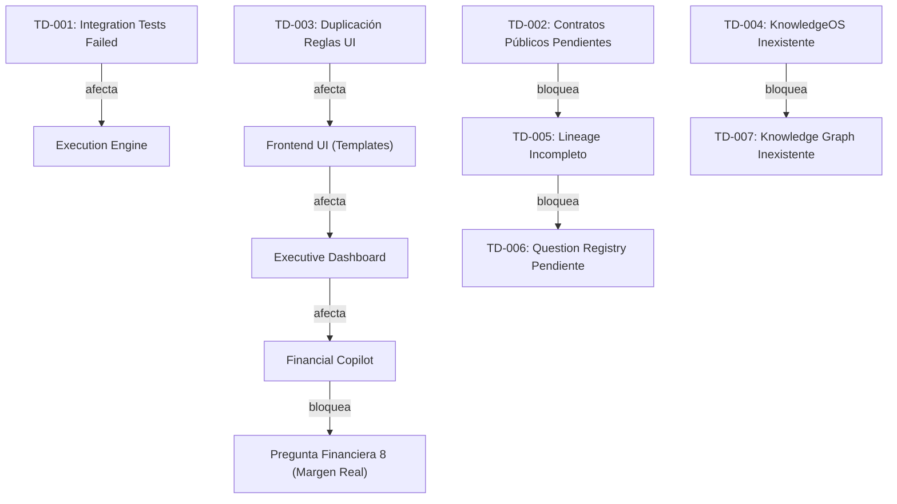

# REGISTRO MAESTRO DE DEUDA TÉCNICA V1

## Regla de Gobierno Fase 0

> [!WARNING]
> ### PROHIBICIÓN DE RESOLUCIÓN PREMATURA EN FASE 0
> Durante la **Fase 0 Foundation**, queda estrictamente prohibido intentar corregir, refactorizar o modificar código para resolver deuda técnica.
> Su único propósito es **inventariar, clasificar y modelar en el grafo** la deuda existente para ser corregida ordenadamente en la **Fase 1 (Corrección de Deuda Técnica)**.

---

## TECHNICAL_DEBT_BACKLOG (Inventario Histórico)

### Item ID: `TD-001`
- **Componente**: Test Suite Integration & Benchmarks (`tests/test_golden.py`, `tests/test_copilot_benchmarks.py`)
- **Descripción**: 184 fallos de aserción en pruebas de integración legacy/golden contra benchmarks desactualizados de snapshots JSON.
- **Causa Raíz**: Evolución de esquemas de respuesta en endpoints API y cierres de Ripley post-B2.5C sin actualización sincronizada de archivos golden benchmark; falta de método load_file en SurgicalLoader; y carácter unicode incompabile en conftest.py.
- **Impacto**: Ruido en ejecuciones de pytest que enmascara posibles regresiones reales.
- **Riesgo**: ALTO
- **Prioridad**: **CRÍTICA** (Resuelto en Fase 1 via CAP-TD-001)
- **Dependencia**: Ninguna
- **Criterio de Cierre**: 100% de tests passing en la suite pytest con benchmarks regenerados y validados (335/335 PASS).
- **Evidencia**: `evidence/fase_1b/CAP-TD-001.json` (335 passed, 0 failed).
- **Estado**: **RESUELTO (CERRADO)** - Resuelto por `CAP-TD-001` el 2026-07-27.

---

### Item ID: `TD-002`
- **Componente**: API Public Contracts & Documentation (`api/api.py`, OpenAPI Specs)
- **Descripción**: Ausencia de especificadores explícitos Pydantic v2 en modelos de respuesta de endpoints `/api/v4/cierre/desglose` y `/api/v4/exec/summary`.
- **Causa Raíz**: Crecimiento orgánico de endpoints durante sprints UX1.0 sin tipado formal estricto en esquemas de entrada/salida.
- **Impacto**: Riesgo de desacople entre cliente frontend y contrato API ante futuros cambios.
- **Riesgo**: MEDIO
- **Prioridad**: **ALTA** (Resuelto en Fase 1 via CAP-TD-002)
- **Dependencia**: `TD-001`
- **Criterio de Cierre**: Implementación de esquemas Pydantic v2 / OpenAPI estrictos para los contratos API de `/api/v4/cierre/desglose`, `/api/v4/exec/summary` y endpoints asociados.
- **Evidencia**: `evidence/fase_1b/CAP-TD-002.json` (830 passed, 0 failed, 12 skipped).
- **Estado**: **RESUELTO (CERRADO)** - Resuelto por `CAP-TD-002` el 2026-07-27.

---

### Item ID: `TD-003`
- **Componente**: User Interface Rules & Templates (`templates/dashboard.html`, `templates/executive_dashboard.html`)
- **Descripción**: Duplicación de lógica de formateo monetario y cálculo de porcentajes entre Javascript inline de Dashboard y Executive Dashboard.
- **Causa Raíz**: Desarrollo independiente de tableros Auditor y Gerencial en iteraciones previas.
- **Impacto**: Duplicidad conceptual y mantenimiento duplicado en cambios visuales de UI.
- **Riesgo**: MEDIO
- **Prioridad**: **MEDIA** (Resuelto en Fase 1 via CAP-TD-003)
- **Dependencia**: `TD-002`
- **Criterio de Cierre**: Extracción y unificación de utilidades de UI en un módulo estático compartido `frontend/shared/financial-formatter.js` consumido por todas las plantillas.
- **Evidencia**: `evidence/fase_1b/CAP-TD-003.json` (830 passed, 0 failed, 12 skipped).
- **Estado**: **RESUELTO (CERRADO)** - Resuelto por `CAP-TD-003` el 2026-07-27.

---

### Item ID: `TD-004`
- **Componente**: Knowledge Governance Layer (`knowledge/`, Documentation)
- **Descripción**: Ausencia de estructura normalizada KnowledgeOS en el directorio de conocimiento del proyecto.
- **Causa Raíz**: Documentación previa distribuida en `governance/`, `knowledge/`, `docs/` y raíz del repositorio sin taxomomía Obsidian.
- **Impacto**: Dificultad para navegación semántica y consumo por agentes/Copilot.
- **Riesgo**: MEDIO
- **Prioridad**: **ALTA** (Resuelto en Fase 1 via CAP-TD-004)
- **Dependencia**: `TD-001`
- **Criterio de Cierre**: Estructura física y gobernada de KnowledgeOS (00_Inbox a 99_Quarantine) y dominios documentales desplegados bajo `knowledge/` con índices base e integración Obsidian.
- **Evidencia**: `evidence/fase_1b/CAP-TD-004.json` (830 passed, 0 failed, 12 skipped).
- **Estado**: **RESUELTO (CERRADO)** - Resuelto por `CAP-TD-004` el 2026-07-27.

---

### Item ID: `TD-005`
- **Componente**: Data Lineage & Traceability Engine
- **Descripción**: Falta de mapeo formal de trazabilidad origen-destino desde archivos RAW hasta agregaciones de Ledger y respuestas Copilot.
- **Causa Raíz**: Pipelines ETL registrados documentalmente en certificaciones pero no modelados en un registro canónico de lineage.
- **Impacto**: Incapacidad de auditar automáticamente el origen exacto de un peso reportado por la API.
- **Riesgo**: ALTO
- **Prioridad**: **ALTA** (Resuelto en Fase 1 via CAP-TD-005)
- **Dependencia**: `TD-002`
- **Criterio de Cierre**: Integración canónica de `LIN-001` a `LIN-012` en KnowledgeOS (`knowledge/lineage/`), conectada con contratos, evidencias, capacidades y las 10 Preguntas Financieras.
- **Evidencia**: `evidence/fase_1b/CAP-TD-005.json` (830 passed, 0 failed, 12 skipped).
- **Estado**: **RESUELTO (CERRADO)** - Resuelto por `CAP-TD-005` el 2026-07-27.

---

### Item ID: `TD-006`
- **Componente**: Financial Copilot Core Architecture
- **Descripción**: Registro de 10 Preguntas Financieras Estratégicas no estandarizado bajo contratos de evidencia.
- **Causa Raíz**: Preguntas definidas conceptualmente en G5.7 pero sin esquema canónico de consulta SQL/DuckDB.
- **Impacto**: Respuestas de Copilot vulnerables a alucinaciones o consultas directas a documentos RAW no certificados.
- **Riesgo**: CRÍTICO
- **Prioridad**: **ALTA** (Resuelto en Fase 1 via CAP-TD-006)
- **Dependencia**: `TD-005`
- **Criterio de Cierre**: Normalización canónica de `Q-001` a `Q-010` (`INT-QF-001` a `INT-QF-010`) en `CopilotEngine` con matriz de sinónimos sin solapamiento y fallback anti-alucinación.
- **Evidencia**: `evidence/fase_1b/CAP-TD-006.json` (884 passed, 0 failed, 12 skipped).
- **Estado**: **RESUELTO (CERRADO)** - Resuelto por `CAP-TD-006` el 2026-07-27.

---

### Item ID: `TD-007`
- **Componente**: System Graph Engine
- **Descripción**: Inexistencia de modelo de grafo dual (Knowledge Graph + Execution Graph) ejecutable.
- **Causa Raíz**: Relaciones entre documentos y componentes registradas únicamente en texto Markdown.
- **Impacto**: Imposibilidad de realizar análisis de impacto automatizado ante cambios en contratos de datos.
- **Riesgo**: MEDIO
- **Prioridad**: **MEDIA** (Resuelto en Fase 1 via CAP-TD-007)
- **Dependencia**: `TD-004`
- **Criterio de Cierre**: Implementación ejecutable determinista de `DualGraphRegistry` en `engine/v4/knowledge/dual_graph.py` con 0 nodos huérfanos, 0 ciclos y exportación JSON/Obsidian.
- **Evidencia**: `evidence/fase_1b/CAP-TD-007.json` (901 passed, 0 failed, 12 skipped).
- **Estado**: **RESUELTO (CERRADO)** - Resuelto por `CAP-TD-007` el 2026-07-27.

---

### Item ID: `TD-008`
- **Componente**: RAW Files Indexing & Integrity Registry
- **Descripción**: Archivos RAW de Falabella, Ripley, Paris y ML carecen de un registro canónico centralizado con SHA-256 e inventario inmutable.
- **Causa Raíz**: Ingestas RAW ejecutadas históricamente por loaders individuales sin catálogo único de archivos fuente.
- **Impacto**: Dificultad para verificar la integridad de la capa RAW contra alteraciones accidentales en disco.
- **Riesgo**: ALTO
- **Prioridad**: **ALTA** (Resuelto en Fase 1 via CAP-TD-008)
- **Dependencia**: `TD-005`
- **Criterio de Cierre**: `RawFileIndexer` implementado en `engine/v4/ingestion/raw_file_indexer.py` con 1,349 archivos indexados, SHA-256 por streaming, detección de duplicados, 0 mutaciones RAW e idempotencia probada.
- **Evidencia**: `evidence/fase_1b/CAP-TD-008.json` (910 passed, 0 failed, 12 skipped).
- **Estado**: **RESUELTO (CERRADO)** - Resuelto por `CAP-TD-008` el 2026-07-27.

---

## Modela de Impacto en Grafo (Technical Debt Dependency Graph)

---

## Nodos en Grafos de Gobierno

### Knowledge Graph Nodes
- `Node:TECHNICAL_DEBT_REGISTRY_V1` (Tipo: `Registro_Deuda_Tecnica`)
- `Node:TD-001` .. `Node:TD-008` (Tipo: `Nodo_Deuda_Tecnica`)

### Execution Graph Nodes
- `ExecNode:AUDIT_TECHNICAL_DEBT_STATUS` (Process: Evaluación de estado y bloqueo de fases por deudas críticas abiertas)

---

## Trazabilidad y Relaciones
- **DOCUMENTA**: Deuda técnica acumulada del proyecto (8 ítems históricos).
- **IMPACTA**: [PMO_REGISTRY_V1](file:///c:/Users/ASUS%20Zenbook/Documents/Marketplace%20Financial%20AI%20Engine/governance/PMO_REGISTRY_V1.md) y planificación de Sprints en Fase 1 a Fase 8.
- **BLOQUEA**: Transición a producción hasta la eliminación de deudas clasificadas como CRÍTICA.

---

## Compatibilidad Obsidian
- Enlace Obsidian: [[TECHNICAL_DEBT_REGISTRY_V1]]
- Mapeo de navegación: `KnowledgeOS/02_Governance/TECHNICAL_DEBT_REGISTRY_V1.md`
